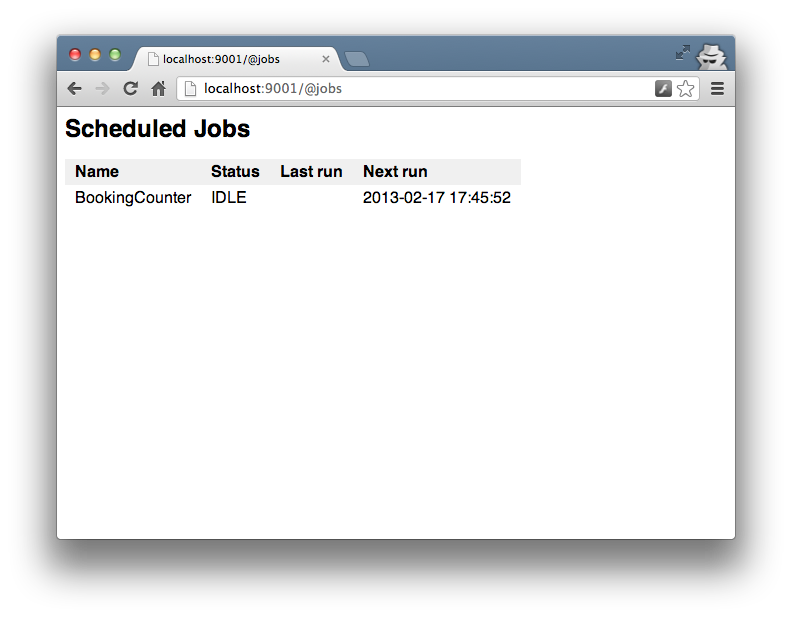

Revel provides the **jobs** framework for performing work asynchronously, outside of the
request flow.  This may take the form of [recurring tasks](#RecurringJobs) that updates cached data
or [one-off tasks](#OneOff) such as sending emails.

## Activation

The framework is included as an optional [module](modules.html), that is not enabled in an
application by default.  To activate it, add `module.jobs` to the [app.conf](appconf.html) file:

	module.jobs = github.com/revel/modules/jobs

Additionally, in order to access the job monitoring page, you will need to add
this line to the `conf/routes` file, which will insert the `/@jobs` url:

	module:jobs

## Options

There are a couple of [configuration settings](appconf.html#Jobs) that tell the framework what sort of limitations
to place on the jobs that it runs. These are listed below with their default values;

- [`jobs.pool = 10`](appconf.html#jobspool) - The number of jobs allowed to run simultaneously
- [`jobs.selfconcurrent = false`](appconf.html#jobsselfconcurrent)  -  Allow a job to run only if previous instances are done

## Implementing Jobs

To create a Job, implement the [`cron.Job`](https://github.com/robfig/cron/) interface.  The `Job` interface has the following signature:


// https://github.com/robfig/cron/blob/master/cron.go
type Job interface {
	Run()
}


For example:


type MyJob struct {}

func (j MyJob) Run() {
   // Do something
}


## Startup jobs

To run a task on application startup, use
[`revel.OnAppStart`](../docs/godoc/server.html#OnAppStart) to register a function.
Revel runs these tasks serially, before starting the server.  Note that this
functionality does not actually use the jobs module, but it can be used to
submit a job for execution that doesn't block server startup.


func init() {
    revel.OnAppStart(func() { jobs.Now(populateCache{}) })
}


## Recurring Jobs

Jobs may be scheduled to run on any schedule.  There are two options for expressing the schedule:

1. A cron specification
2. A fixed interval

Revel uses the [cron library](https://github.com/revel/cron) to parse the
schedule and run the jobs.  The library's
[README](https://github.com/revel/cron/blob/master/README.md) provides a detailed
description of the format accepted.

Jobs are generally registered using the
[`revel.OnAppStart`](../docs/godoc/server.html#OnAppStart) hook, but they may be
registered at any later time as well.

Here are some examples:


import (
    "github.com/revel/revel"
    "github.com/revel/modules/jobs/app/jobs"
    "time"
)

type ReminderEmails struct {
    // filtered
}

func (e ReminderEmails) Run() {
    // Queries the DB
    // Sends some email
}

func init() {
    revel.OnAppStart(func() {
        jobs.Schedule("0 0 0 * * ?",  ReminderEmails{})
        jobs.Schedule("@midnight",    ReminderEmails{})
        jobs.Schedule("@every 24h",   ReminderEmails{})
        jobs.Every(24 * time.Hour,    ReminderEmails{})
    })
}


## Named schedules

You can [configure schedules ](appconf.html#Jobs) in the [`app.conf`](appconf.html) file and reference them anywhere.
This provides an easy way to reuse, and a useful description for crontab specs.

Here is an example **named cron schedule**, in an [`app.conf`](appconf.html) file:

    cron.workhours_15m = 0 */15 9-17 ? * MON-FRI

Use the named schedule by referencing it anywhere you would have used a cron spec.


func init() {
    revel.OnAppStart(func() {
        jobs.Schedule("cron.workhours_15m", ReminderEmails{})
    })
}


> **Note:** The cron schedule name must begin with `cron.`

## One-off Jobs

Sometimes it is necessary to do something in response to a user action.  In these
cases, the jobs module allows you to submit a job to be run a single time.

The only control offered is how long to wait until the job should be run.


type AppController struct { *revel.Controller }

func (c AppController) Action() revel.Result {
    // Handle the request.
    ...

    // Send them email asynchronously, right now.
    jobs.Now(SendConfirmationEmail{})

    // Or, send them email asynchronously after a minute.
    jobs.In(time.Minute, SendConfirmationEmail{})
}


## Registering functions

It is possible to register a `func()` as a job by wrapping it in the `jobs.Func`
type.  For example:


func sendReminderEmails() {
    // Query the DB
    // Send some email
}

func init() {
    revel.OnAppStart(func() {
        jobs.Schedule("@midnight", jobs.Func(sendReminderEmails))
    })
}


## Job Status

The jobs module provides a status page (`/@jobs` url) that shows:

- a list of the scheduled jobs it knows about
- the current status; **IDLE** or **RUNNING**
- the  previous and next run times

For security purposes, the status page is restricted to requests that originate
from 127.0.0.1.

## Constrained pool size

It is possible to configure the job module to limit the number of jobs that are
allowed to run at the same time.  This allows the developer to restrict the
resources that could be potentially in use by asynchronous jobs -- typically
interactive responsiveness is valued above asynchronous processing.  When a pool
is full of running jobs, new jobs block to wait for running jobs to complete.

**Implementation Note**: The implementation blocks on a channel receive, which is
implemented to be [FIFO](http://en.wikipedia.org/wiki/FIFO) for waiting goroutines (but not specified/required to be
so). [See here for discussion](https://groups.google.com/forum/?fromgroups=#!topic/golang-nuts/CPwv8WlqKag).

## Future areas for development

* Allow access to the job status page with HTTP Basic Authentication credentials
* Allow administrators to run scheduled jobs interactively from the status page
* Provide more visibility into the job runner, e.g. the pool size, the job queue length, etc.
