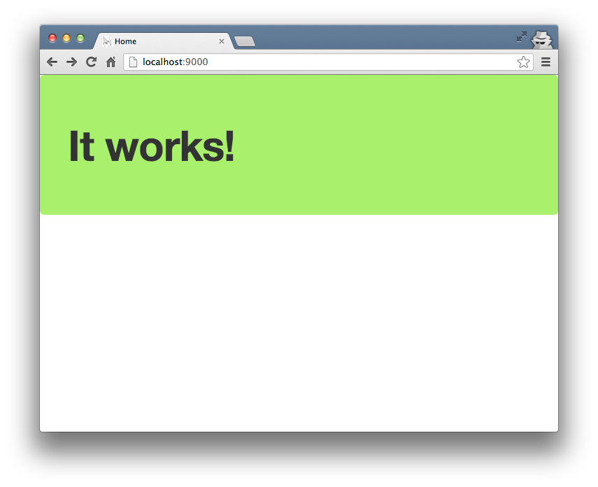

Use the [`revel`](../manual/tool.html#mew) command line tool to create a new application in your GOPATH and run it:

$ export GOPATH="/home/me/gostuff"
$ cd $GOPATH
$ revel new myapp
~
~ revel! http://revel.github.io
~
Your application is ready:
    /home/me/gostuff/src/myapp

You can run it with:
    revel run myapp

$ revel run myapp
~
~ revel! http://revel.github.io
~
2012/09/27 17:01:54 run.go:41: Running myapp (myapp) in dev mode
2012/09/27 17:01:54 harness.go:112: Listening on :9000

Another Example

$ revel new github.com/myaccount/myapp
$ revel run github.com/myaccount/myapp

Open your browser to [http://localhost:9000/](http://localhost:9000/) to see a notification that your app is ready.

- The generated project structure is described in [organization](../manual/organization.html)
- The HTTP port settings is in [`conf/app.conf`](../manual/appconf.html#httpport)

<a href="requestflow.html" class="btn btn-sm btn-success" role="button">Next &gt;&gt;</a> [How Revel handles requests.](requestflow.html)
